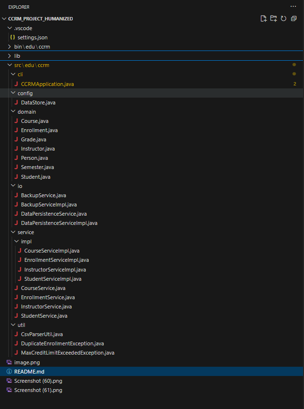
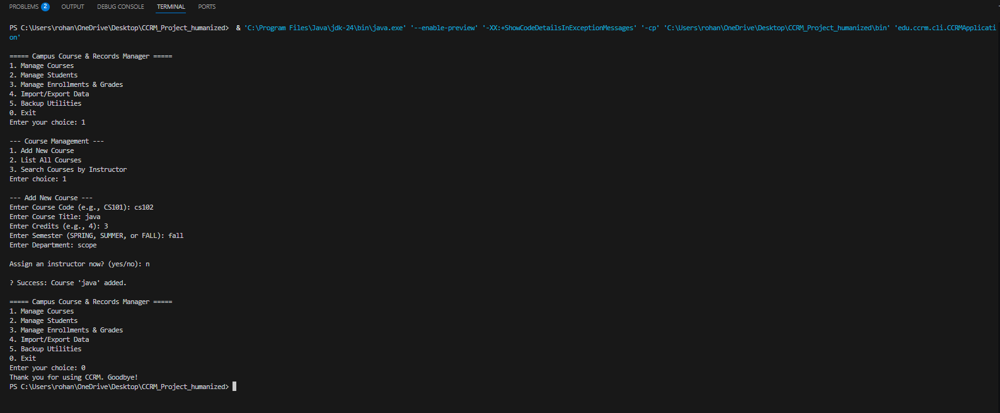

# Campus Course & Records Manager (CCRM)

> **Name:** Samarth Dwivedi
>
> **Registration Number:** 24BCE10041
>
> ---

## 1. Project Overview

The **Campus Course & Records Manager (CCRM)** is a console-based Java application designed to manage the core academic operations of an educational institute. It provides a robust command-line interface (CLI) for administrators to manage students, courses, enrollments, and grades.

This project is built on the **Java SE (Standard Edition)** platform and serves as a practical demonstration of a wide array of core and advanced Java concepts, including Object-Oriented principles, modern APIs for I/O (NIO.2), collections (Streams), and the Date/Time API.

### Key Features
* **Student Management:** Add, list, and update student records.
* **Course Management:** Create, update, and search/filter courses by department or instructor.
* **Enrollment & Grading:** Handle student enrollment with business rule validation and record grades.
* **Transcripts:** Generate and display student academic transcripts.
* **File Persistence:** Import and export all application data to and from CSV files.
* **Backup Utility:** Create timestamped backups of the application data directory.

---

## 2. How to Run the Application

### Prerequisites
* **Java Development Kit (JDK) 11** or a higher version.
* An IDE like **VS Code** or **Eclipse**, or a command-line terminal.

### Running from an IDE
1.  Open the project folder in your IDE (e.g., VS Code with the Extension Pack for Java).
2.  Locate the main class: `src/edu/ccrm/cli/CCRMApplication.java`.
3.  Run the application directly from the IDE (e.g., by clicking the "Run" button above the `main` method in VS Code).

### Running from the Command Line
1.  Open a terminal and navigate to the project's root directory (the one containing `src`).
2.  Create a `bin` directory for the compiled files:
    ```bash
    mkdir bin
    ```
3.  Compile the entire project into the `bin` directory:
    ```bash
    javac -d bin src/edu/ccrm/cli/CCRMApplication.java
    ```
4.  Run the application, specifying `bin` as the classpath:
    ```bash
    java -cp bin edu.ccrm.cli.CCRMApplication
    ```

---

## 3. Core Java Concepts Explained

### Evolution of Java (Abridged)
* **1995:** Java 1.0 is released by Sun Microsystems.
* **2004:** J2SE 5.0 introduces major features like Generics, Enums, and Annotations.
* **2014:** Java SE 8 revolutionizes the language with Lambdas, the Stream API, and a new Date/Time API.
* **2018:** Java SE 11 is released as a key Long-Term Support (LTS) version.
* **2021:** Java SE 17 becomes the next LTS version.

### Java ME vs. SE vs. EE

| Feature        | Java ME (Micro Edition)              | Java SE (Standard Edition)            | Java EE (Enterprise Edition)            |
|----------------|--------------------------------------|---------------------------------------|-----------------------------------------|
| **Purpose**    | Small, resource-constrained devices  | General-purpose desktop & server apps | Large-scale, distributed web apps       |
| **Target**     | Mobile phones, embedded systems      | Desktops, laptops, servers            | Application servers, enterprise systems |

### Java Architecture: JDK, JRE, and JVM
* **JVM (Java Virtual Machine):** The runtime environment that executes Java bytecode, enabling platform independence.
* **JRE (Java Runtime Environment):** Contains the JVM and the core Java libraries required to run Java applications.
* **JDK (Java Development Kit):** A superset of the JRE that includes development tools like the compiler (`javac`) and debugger (`jdb`), required to write and compile Java code.

---

## 4. Setup and Installation (Windows)

1.  **Download & Install JDK:** Obtain the Java Development Kit installer from a trusted source (e.g., Oracle, Adoptium) and run it.
2.  **Configure Environment Variables:** Set the `JAVA_HOME` variable to your JDK installation path and add the JDK's `bin` directory to the system `Path` variable.
3.  **Verify Installation:** Open a new command prompt and run `java -version` and `javac -version` to confirm the installation.

> .png>)
>
> **1. JDK Installation Verification (`java -version` output):**
>
> .png>)
>
> **2. IDE Project Setup (Eclipse / VS Code):**
>
> 
>
> **3. Program Running in the Console:**
>
> 
>
> ---

## 5. Technical Requirements Mapping

This table maps the project's technical requirements to the specific files and methods where they are demonstrated.

| Feature & Concept                 | Location in Project                                        | Justification                                                                                             |
|-----------------------------------|------------------------------------------------------------|-----------------------------------------------------------------------------------------------------------|
| **OOP Principles**                | `Person`, `Student`, `Course` in the `domain` package      | Demonstrates Inheritance, Abstraction, Polymorphism, and Encapsulation.                                   |
| **Singleton Pattern**             | `DataStore.java` in the `config` package                   | A single, central class to hold all application data, ensuring a single source of truth.                  |
| **Builder Pattern**               | `Course.Builder` inside `Course.java`                      | A clean and readable way to construct complex `Course` objects.                                           |
| **Services Layer**                | The `service` package                                      | Contains all business logic, separating it from the UI and data layers.                                   |
| **Custom Exceptions**             | `MaxCreditLimitExceededException.java`                     | Demonstrates custom, checked exception handling for specific business rules.                              |
| **Streams & Lambdas**             | `CourseServiceImpl.java`                                   | Uses modern Java Streams and Lambdas to search and filter data collections.                               |
| **NIO.2 for File I/O**            | The `io` package                                           | Handles all file saving, loading, and backups using Java's modern New I/O system.                         |
| **Date/Time API**                 | `Enrollment.java`, `BackupServiceImpl.java`                | Uses the modern Date/Time API to timestamp enrollments and backup folders.                                |

---

## 6. Usage Guide and Sample Data

To test the import functionality, create a directory named `data` in the project's root folder and add the following files.

#### `data/students.csv`
```csv
1,Jean Grey,jean.g@ccrm.edu,2002-03-22,S001
2,Scott Summers,scott.s@ccrm.edu,2001-11-01,S002
```

#### `data/courses.csv`
```csv
CS101,Intro to Programming,4,FALL,Computer Science,101
PHY201,Quantum Mechanics,5,FALL,Physics,102
```

### Sample CLI Interaction
```
===== Campus Course & Records Manager =====
Enter your choice: 3

--- Enrollment & Grading ---
Enter choice: 1
Enter Student Registration No (e.g., S001): S001
Enter Course Code to enroll in (e.g., CS101): CS101
Success: Student Jean Grey enrolled in Intro to Programming.
```

---

## 7. GitHub Repository URL:

> https://github.com/RohanRathi2006/Campus-Course-Records-Manager-CCRM-.git
> ---